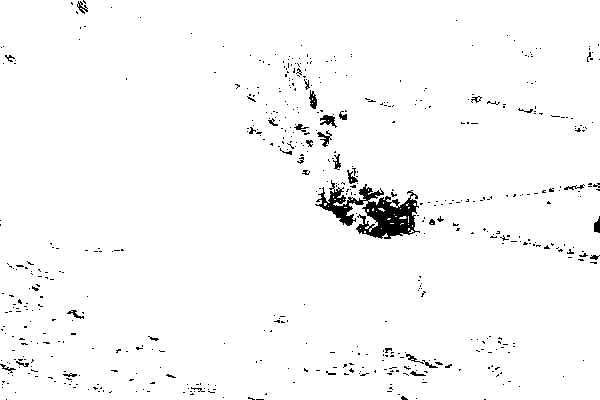
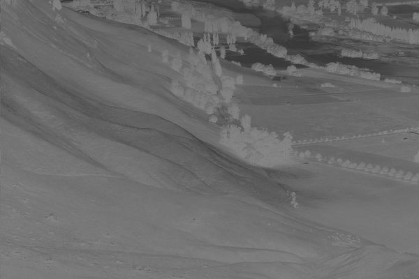

# Projekt CUDA
## Operacje na histogramach
Użyte w projekcie kernele wykonują operacje:

### 1. Obliczanie wartości histogramu
Zdjęcie oryginalne:

### 2. Operacja liniowa

### 3. Wyrównanie histogramu

### 4. Rozszerzenie liniowe

### 5. Rozszerzenie nieliniowe

### 6. Progowanie

### 7. Inwersja

